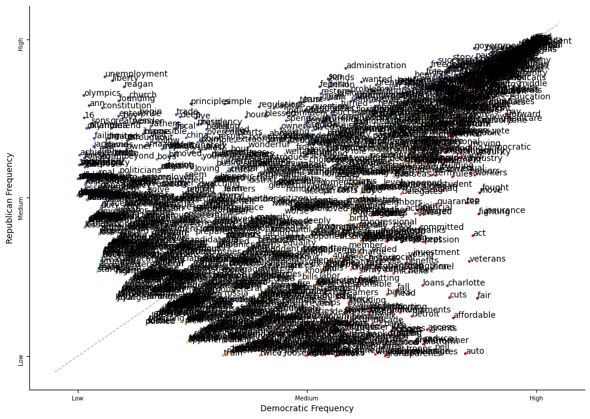
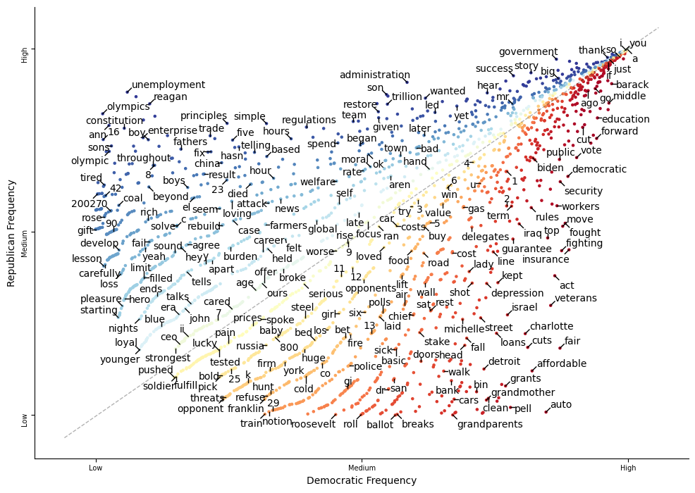
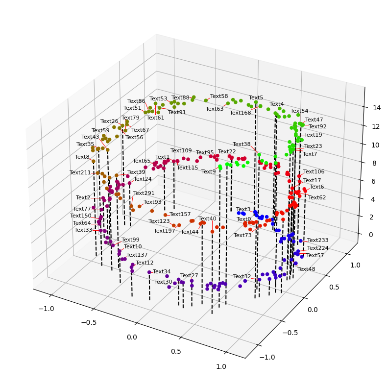
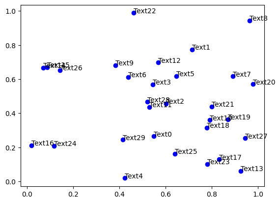
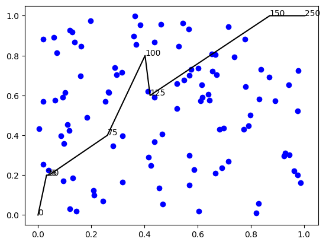
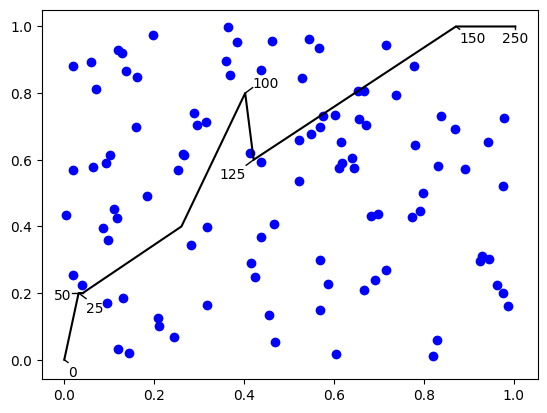
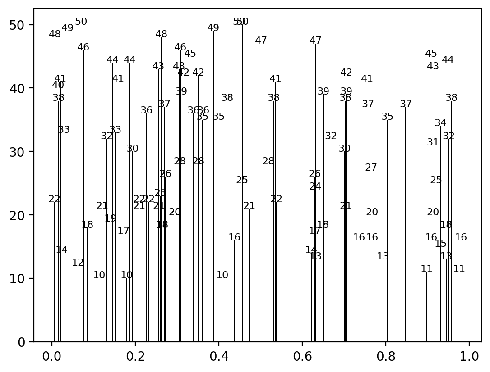
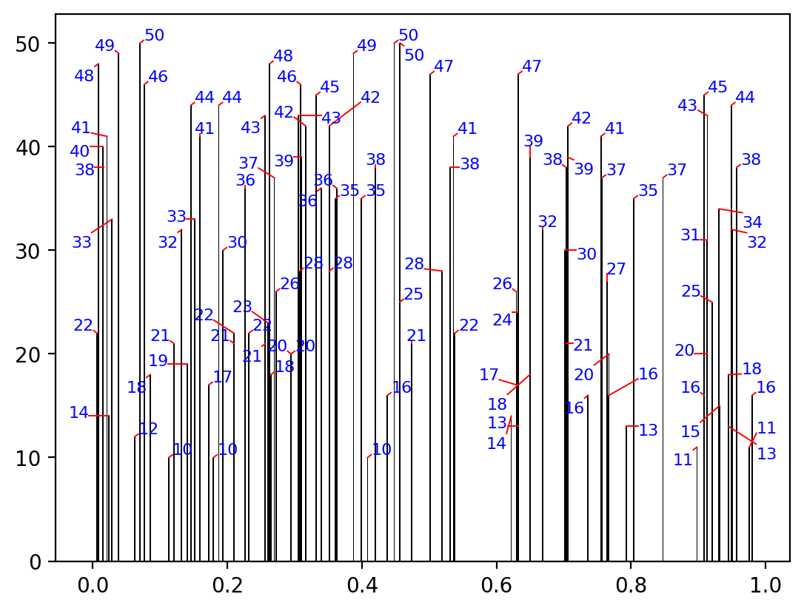
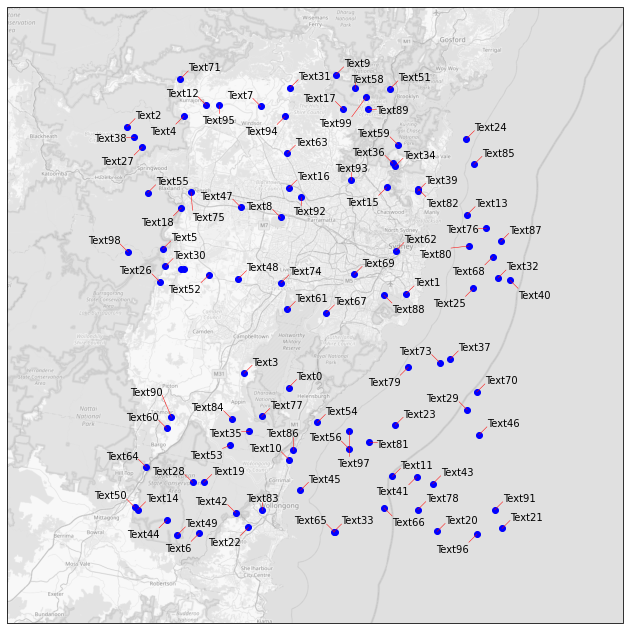

# textalloc - Efficient matplotlib Text Allocation

plt.text|textalloc
:-------------------------:|:-------------------------:
|
|
<div align="center">
Scatterplot design in top row from scattertext (https://github.com/JasonKessler/scattertext)
</div>

# Table of contents
1. [Quick-start](#quickstart)
2. [Features](#features)
3. [Parameters](#parameters)
4. [Implementation and speed](#implementation)
5. [Examples](#examples)

# Quick-start

textalloc allocates text labels in matplotlib plots and is an alternative to adjustText (https://github.com/Phlya/adjustText).

## Installation

```
pip install textalloc
```

## Using textalloc

The code below generates the plot to the right:

```
import textalloc as ta
import numpy as np
import matplotlib.pyplot as plt

np.random.seed(0)
x, y = np.random.random((2,30))
fig, ax = plt.subplots()
ax.scatter(x, y, c='b')
text_list = [f'Text{i}' for i in range(len(x))]
ta.allocate(ax,x,y,
            text_list,
            x_scatter=x, y_scatter=y,
            textsize=10)
plt.show()
```

plt.text|textalloc
:-------------------------:|:-------------------------:
|

# Features

Avoids the following types of text label overlaps:
- Lines
- Points
- Plot boundary
- Other text labels
- Arbitrary objects when providing the scatter plot object

Other supported features:
1. Setting min and max distances between text labels and objects
2. Drawing lines between label and the corresponding position, optionally also avoiding overlap with these lines
3. Draw all text labels, or only the subset that has no internal overlap
3. Setting direction of text labels w.r.t. the corresponding positions
4. Plotting in 3D by providing z-coordinates for a 3D axes
5. Plotting on images
6. Using custom transforms

# Parameters

Text-boxes input parameters are x, y and text_list, which define the text-strings to be plotted and the positions that the texts should point to.
x_scatter, y_scatter, x_lines and y_lines define all points and lines in the plot that should not overlap with the text-boxes. Note that the scattered points do not have to be the same as x and y for the text-boxes, but can include more, or different scattered points.

```
ax:
    matplotlib axes used for plotting.
x: (array-like):
    x-coordinates of texts.
y: (array-like):
    y-coordinates of texts.
text_list: (array-like):
    list of texts.
z: (array-like), default None
    z-coordinates of texts in case of plotting in 3D.
x_scatter: (array-like), default None
    x-coordinates of all scattered points.
y_scatter: (array-like), default None
    y-coordinates of all scattered points.
z_scatter: (array-like), default None
    z-coordinates of all scattered points in case of plotting in 3D.
x_lines: (array-like), default None
    pairs of x-coordinates of all lines in the plot (start and endpoint).
y_lines: (array-like), default None
    pairs of y-coordinates of all lines in the plot (start and endpoint).
z_lines: (array-like), default None
    pairs of z-coordinates of all lines in the plot (start and endpoint) in case of plotting in 3D.
scatter_sizes: (array-like), default None
    sizes of all scattered objects in plot list of 1d arrays/lists.
scatter_plot:
    provide a scatterplot object (scatter_plot=ax.scatter(...))
    for more exact placement instead of x_scatter, y_scatter, scatter_sizes etc.. default None.
text_scatter_sizes: (array-like), default None
    sizes of text scattered objects in plot list of 1d arrays/lists.
textsize: (Union[int, List[int]]), default 10
    Size of text.
margin: (float), default 0.0
    Parameter for margins between objects. Recommendation: keep this lower than min_distance.
    Increase for larger margins to points and lines.
    Given in proportion of x-ax dimensions (0-1)
min_distance: (float), default 0.015
    Parameter for min distance from textbox to
    its plotted position.
    Given in proportion of x-ax dimensions (0-1)
max_distance: (float), default 0.2
    Parameter for max distance from textbox to
    its plotted position.
    Given in proportion of x-ax dimensions (0-1)
verbose: (bool), default False
    prints progress using tqdm.
draw_lines: (bool), default True
    draws lines from original points to textboxes.
linecolor: (Union[str, List[str]]), default "r"
    Color code of the lines between points and text-boxes.
draw_all: (bool), default True
    Draws all texts after allocating as many as possible despite overlap.
nbr_candidates: (int), default 200
    Sets the number of candidates used.
linewidth: (float), default 1
    Width of line between textbox and it's origin.
textcolor: (Union[str, List[str]]), default "k"
    Color code of the text.
seed: (int), default 0
    Seeds order of text allocations.
direction: (str), default None
    Sets the preferred direction of the boxes with options:
    (south, north, east, west, northeast, northwest, southeast, southwest).
avoid_label_lines_overlap: (bool), default False
    If set to True, avoids overlap for drawn lines to text labels.
plot_kwargs: (dict), default None
    kwargs for the plt.plot of the lines if draw_lines is True.
**kwargs: ()
    kwargs for the plt.text() call.
    If transform is used, it only needs to be provided here, i.e. not also in plot_kwargs.
```

The allocate call returns a tuple containing the resulting positions used to plot the text labels and the connecting label lines.

# Implementation and speed

The implementation aims to plot as many text-boxes as possible in the free space in the plot. There are three main steps of the algorithm:

For each textbox to be plotted:
1. Generate a large number of candidate boxes near the original point with size that matches the fontsize.
2. Find the candidates that do not overlap any points, lines, plot boundaries, or already allocated boxes.
3. Allocate the text to the first candidate box with no overlaps.

## Speed

The plot in the top of this Readme was generated in 2.1s on a laptop, and there are rarely more textboxes that fit into one plot. If the result is still too slow to render, try decreasing `nbr_candidates`.

The speed is greatly improved by usage of numpy broadcasting in all functions for computing overlap (see `textalloc/overlap_functions` and `textalloc/find_non_overlapping`). A simple example from the function `non_overlapping_with_boxes` which checks if the candidate boxes (expanded with xfrac, yfrac to provide a margin) overlap with already allocated boxes:

```
candidates[:, 0][:, None] - xfrac > box_arr[:, 2]
```

The code compares xmin coordinates of all candidates with xmax coordinates of all allocated boxes resulting in a boolean matrix of shape (N_candidates, N_allocated) by use of indexing `[:, None]`.

# Examples

textalloc supports avoiding overlap with points, lines, and the plot boundary in addition to other text-boxes. See examples below and `demo.py` for all examples.

```
import textalloc as ta
import numpy as np
import matplotlib.pyplot as plt

x_line = np.array([0.0, 0.03192317, 0.04101177, 0.26085659, 0.40261173, 0.42142198, 0.87160195, 1.00349979])
y_line = np.array([0. , 0.2, 0.2, 0.4, 0.8, 0.6, 1. , 1. ])
text_list = ['0', '25', '50', '75', '100', '125', '150', '250']
np.random.seed(0)
x, y = np.random.random((2,100))

fig,ax = plt.subplots(dpi=100)
ax.plot(x_line,y_line,color="black")
ax.scatter(x,y,c="b")
ta.allocate(ax,x_line,y_line,
            text_list,
            x_scatter=x, y_scatter=y,
            x_lines=[x_line], y_lines=[y_line])
plt.show()
```

plt.text|textalloc
:-------------------------:|:-------------------------:
|

```
import textalloc as ta
import numpy as np
import matplotlib.pyplot as plt

np.random.seed(2017)
x_data = np.random.random_sample(100)
y_data = np.random.random_integers(10,50,(100))

f, ax = plt.subplots(dpi=200)
bars = ax.bar(x_data, y_data, width=0.002, facecolor='k')
ta.allocate(ax,x_data,y_data,
            [str(yy) for yy in list(y_data)],
            x_lines=[np.array([xx,xx]) for xx in list(x_data)],
            y_lines=[np.array([0,yy]) for yy in list(y_data)], 
            textsize=8,
            margin=0.004,
            min_distance=0.005,
            linewidth=0.7,
            nbr_candidates=100,
            textcolor="b")
plt.show()
```

plt.text|textalloc
:-------------------------:|:-------------------------:
|

```
import textalloc as ta
import numpy as np
import matplotlib.pyplot as plt

fig = plt.figure(figsize=(10,10), dpi=200)
ax = plt.axes(projection='3d')
nPoints = 300
nLines = 50
z = 15 * np.random.random(nPoints)
x = np.sin(z) + 0.1 * np.random.randn(nPoints)/2
y = np.cos(z) + 0.1 * np.random.randn(nPoints)/2
x_lines = [[_x, _x] for _x in x[:nLines]]
y_lines = [[_y, _y] for _y in y[:nLines]]
z_lines = [[0, _z] for _z in z[:nLines]]
text_list = [f'Text{i}' for i in range(len(x))]
ax.scatter(x,y,z,c=z, cmap="brg", alpha=1)
for xl,yl,zl in zip(x_lines, y_lines, z_lines):
        ax.plot(xl, yl, zl, "k--")
ta.allocate(ax,x,y,text_list,z=z,
        x_scatter=x, y_scatter=y, z_scatter=z,
        x_lines=x_lines, y_lines=y_lines, z_lines=z_lines,
        avoid_label_lines_overlap=True,
        draw_all=False, linewidth=0.7, textsize=8, max_distance=0.07)
plt.show()
```

plt.text|textalloc
:-------------------------:|:-------------------------:
|

## Plotting on images and using transforms

textalloc now also supports plotting on images and using transforms. Below is an eample of using the PlateCarree transform to plot on top of a downloaded OSM-map (thank you @nebukadnezar for the example).

```
import numpy as np
import matplotlib.pyplot as plt
import cartopy.crs as ccrs
import cartopy.io.img_tiles as cimgt
import textalloc as ta

np.random.seed(1)
x = np.random.rand(100)
x += 150.5
y = np.random.rand(100)
y -= 34.5

dpi = 72
fig = plt.figure(figsize=(800/dpi, 800/dpi), dpi=dpi)

zoom = 10
sitelon = np.mean(x)
sitelat = np.mean(y)
radius = (np.max(x) - np.min(x) ) / 1.5
ll_lon = sitelon - radius * (1/np.cos(np.radians(sitelat)))
ll_lat = sitelat - radius
ur_lon = sitelon + radius * (1/np.cos(np.radians(sitelat)))
ur_lat = sitelat + radius
extent = [ll_lon, ur_lon, ll_lat, ur_lat]

request = cimgt.OSM(desired_tile_form="L")
ax = plt.axes(projection=request.crs)
ax.set_extent(extent)
ax.add_image(request, zoom, alpha=0.5, cmap='gray')
ax.scatter(x, y, c='b', transform=ccrs.PlateCarree())

text_list = [f'Text{i}' for i in range(len(x))]
ta.allocate(ax,x,y,
            text_list,
            x_scatter=x, y_scatter=y,
            textsize=10,
            draw_lines=True,
            linewidth=0.5,
            draw_all=False,
            transform=ccrs.PlateCarree(),
            avoid_label_lines_overlap=True)
plt.show()
```
